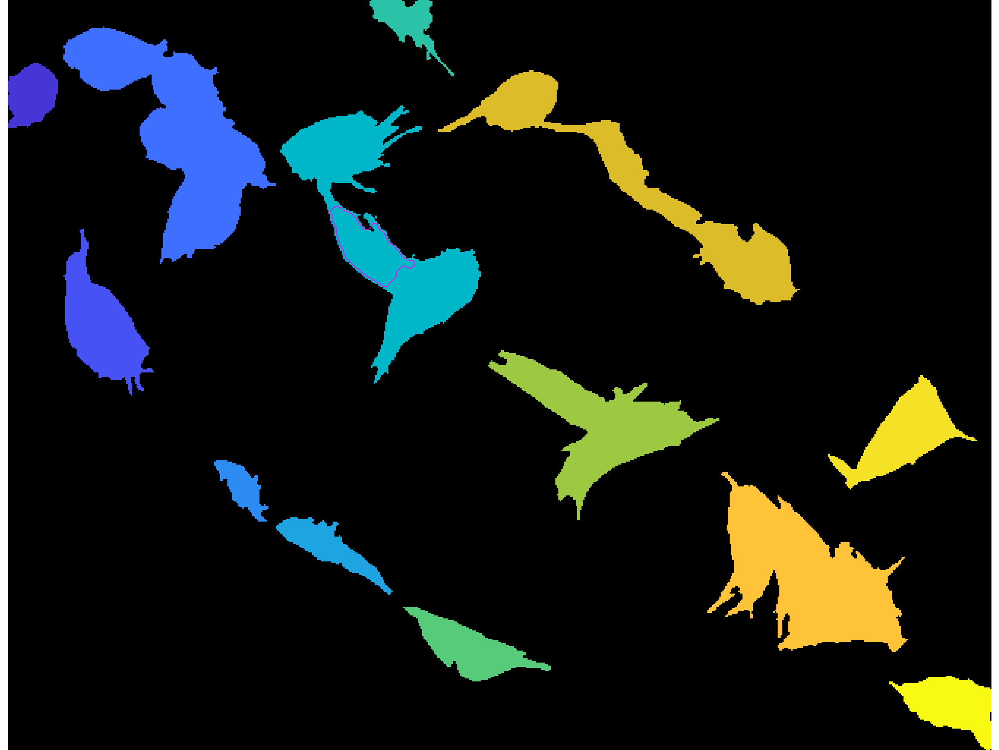

In this log file, the developments of script file
[`script_macrosanglegram`](../script_macrosanglegram.m)
to adjust the junction positions and the cell candidates generated from
those, into setting the right initial points for the level set method
developed in Lu's paper from 2015.

In our case, because the macrophages in the clumps have various forms,
the job of determining the boundaries that correspond to each of the
nuclei present can be trickier than with a simple euclidean distance. The
shapes are simply more complex.



It can be seen how the function was not able to disambiguate the clump
accurately. Having run this code in previous tests, we can analyse the
inputs and outputs, seeing what is needed to **plug-in** the information
of shape that spawns from finding the junctions via the _anglegram_.

## First thoughts: Initial data and previous attempts
In previous attempts, done in script file
[`script_demomacros`](../script_demomacros.m), the method was run in an
naïve attempt to test the capabilities of the level set implementation.
The results were not convincing, and other routes were explored.

At the time, only a very simple segmentation was used (picture above) and only
the very initial `Common/` data was saved, that is:
+ `NucleiMask.mat` with the information of the segmented nuclei.
+ `SceneCytoClumpMaskSet.mat` with the information of the segmented
  green channel, with clumps.

This approach was OK at the time because we did not have much else, and because
the objective was to look for potential into this technique. Also, it is worth
noting that this code was not intended for having segments of it being plugged
in, but it serves as a black box in most cases, so every change I wish to make
will have to be done by creating **interfacing functions with my methods**
that produce the inputs and outputs that each subroutine requires.
## For this implementation
The changes made would need to go into the initial rough cell approximation.
On line `124` of function
[`compute_rad_distmap`](../Funs/InitialGuess/compute_rad_distmap.m).
Line `124` looks as follows:
```Matlab
% Rough Initial Guess of Each Cell
rough_DistMapSetByNuclei = compute_rad_distmap(clumpMask_j, ...
    nucleusMask_inside_Clump_j, beta);
```
Where `clumpMask_j` is the binary image with the current clump `j` and
`nucleusMask_inside_Clump_j` is the binary image that contains the nuclei
in the current clump. The `rough_DistMapSetByNuclei` variable contains all
the initial values for the level set method, as computed by a first
interpretation of the clump boundary and the extrapolation of it into a
_mask guess if the clump_.

For us to plug in our functions, we would need to work on a clump basis.
Computing the anglegram and producing the outputs for the relevant functions.
